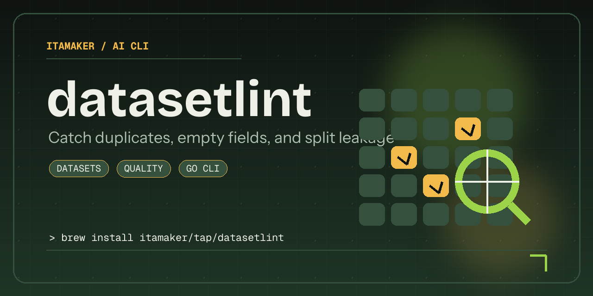

# datasetlint

[](#contributors-)

`datasetlint` is a Go CLI that catches common dataset quality issues before they leak into training or evaluation.

It is designed for JSONL-based LLM datasets where duplicate prompts, empty fields, and train/eval overlap can quietly corrupt results.



## Support

[](https://buymeacoffee.com/amaker)

## Quickstart

### Install

```bash
brew install itamaker/tap/datasetlint
```

<details>
<summary>You can also download binaries from <a href="https://github.com/itamaker/datasetlint/releases">GitHub Releases</a>.</summary>

Current release archives:

- macOS (Apple Silicon/arm64): `datasetlint_0.1.0_darwin_arm64.tar.gz`
- macOS (Intel/x86_64): `datasetlint_0.1.0_darwin_amd64.tar.gz`
- Linux (arm64): `datasetlint_0.1.0_linux_arm64.tar.gz`
- Linux (x86_64): `datasetlint_0.1.0_linux_amd64.tar.gz`

Each archive contains a single executable: `datasetlint`.

</details>

### First Run

Run:

```bash
datasetlint scan -train examples/train.jsonl -eval examples/eval.jsonl
```

## Requirements

- Go `1.22+`

## Run

```bash
go run . scan -train examples/train.jsonl -eval examples/eval.jsonl
```

Strict mode exits with a non-zero status when issues are found:

```bash
go run . scan -train examples/train.jsonl -eval examples/eval.jsonl -strict
```

## Build From Source

```bash
make build
```

```bash
go build -o dist/datasetlint .
```

## What It Does

1. Parses train and eval JSONL files.
2. Detects missing IDs and empty input or output fields.
3. Flags duplicate normalized inputs within a split.
4. Detects overlap between train and eval inputs.
5. Summarizes label counts for quick dataset inspection.

## Notes

- `-json` is useful for CI checks or automated dataset pipelines.
- Maintainer release steps live in `PUBLISHING.md`.

## Contributors ✨

| [![Zhaoyang Jia][avatar-zhaoyang]][author-zhaoyang] |
| --- |
| [Zhaoyang Jia][author-zhaoyang] |


[author-zhaoyang]: https://github.com/itamaker
[avatar-zhaoyang]: https://images.weserv.nl/?url=https://github.com/itamaker.png&h=120&w=120&fit=cover&mask=circle&maxage=7d
